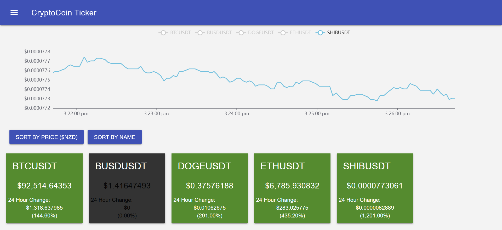

# CryptoCoin Ticker  

Cryptocurrency viewer written in [Typescript](https://www.typescriptlang.org/) with the [Angular](https://angular.io/) framework. Cryptocurrencies are sourced from [Binance](https://binance-docs.github.io/apidocs/spot/en/#change-log) and can be managed by the user.

---

Live with CI/CD: https://cryptocoin-ticker.herokuapp.com/

## Technologies

Project created with:

- [Angular](https://angular.io/) 
- [Typescript](https://www.typescriptlang.org/) 
- [Express](http://expressjs.com/) 
- [ngx-echarts](https://www.npmjs.com/package/ngx-echarts) 
- [Material Design Lite](https://getmdl.io/)
- [Binance API](https://binance-docs.github.io/apidocs/spot/en/#change-log)

## Launch

Hosted at:  https://cryptocoin-ticker.herokuapp.com/

#### Development server

Run ng serve for a dev server. Navigate to http://localhost:4200/. The app will automatically reload if you change any of the source files.

#### Build

Run ng build to build the project. The build artifacts will be stored in the dist/ directory. Use the --prod flag for a production build.
